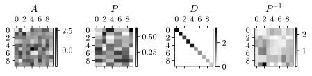
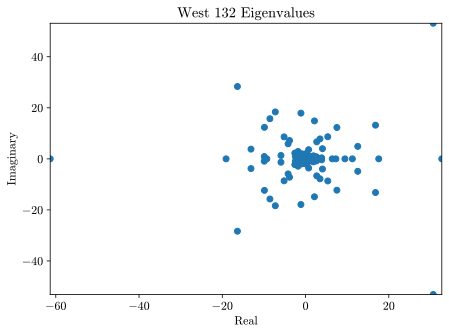
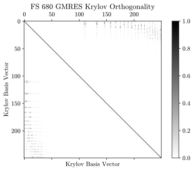
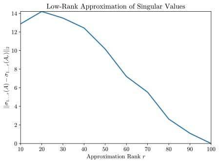
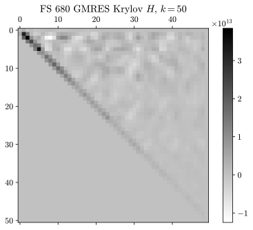

---
authors:
- name: Adam Furman
  orcid: 0000-0002-6675-1064
  affiliation: 1
affiliations:
- name: University of Oxford Mathematical Institute, Oxford, United Kingdom
  index: 1
bibliography:
- pysci.bib
date: 29 September 2023
title: "MathMat: A Mathematically Aware Matrix Library"
tags:
  - Python
  - Linear Algebra
  - Matrix
---

# Introduction

Python is the world's most used programming language [@Carbonnelle2023].
Its popularity stems from its versatility: Python can be used to make a
game, a website, or a plot of a PDE solution with roughly equivalent
amounts of specialization. The vast amount of open source Python
libraries make it a generalist language, adaptable to almost any
purpose. Among the scientific computing community, Python is becoming a
kind of *lingua franca*, and is often reached for as the default when
starting a new project or introducing a student to programming
[@Wang2022].

Despite its versatility --- and from a structural perspective, because
of it --- Python is not a high-performance language. This is especially
true when it comes to manipulating large amounts of data, where memory
needs to be allocated: its interpreted nature puts Python at a
disadvantage. For scientific computing applications, performance is
often a major concern, and thus libraries have been developed to
delegate the process of manipulating data to lower-level code, most
often written in C or Fortran. The NumPy [@NumPy] and SciPy [@SciPy]
libraries are the two most prominent, providing mechanisms for working
with numerical data and implementations of common algorithms.

Both NumPy and SciPy have ways to represent matrices numerically, and
methods of computing or checking various matrix properties. However,
neither library is entirely designed with purely linear algebra in mind.
The provided representations of matrices have no sense of their own
\"matrix-ness,\" that is, they are collections of data with no awareness
of any mathematical properties associated with that data. It is left to
the programmer to keep track of such properties in a specific
application.

The MathMat library provides a mathematically aware
toolbox for working with numerical linear algebra problems. The core
idea is to represent a matrix in two parts: the data, comprising the
entries of the matrix, and a collection of known properties about the
matrix. Checking or computing a property stores it in the matrix object,
allowing it to be reused without additional computational cost. In
addition, the methods for computing properties are stateful, in that
they respond to what other properties have already been computed. For
example, if a matrix is triangular, the eigenvalues are the entries on
the diagonal. Thus, when computing eigenvalues of a matrix known to be
triangular, MathMat returns the diagonal instead of
performing an additional expensive computation.

In addition to mathematical awareness of matrix properties,
MathMat contains implementations of some matrix
algorithms, specifically Krylov subspace methods. The package has
visualization capabilities as well, focusing on generating plots that
are aesthetically pleasing and clearly visible within academic papers,
with focus again towards those useful in numerical linear algebra.

## The Library Structure

MathMat is organized into one library with five
submodules, including the main module. Each submodule covers a specific
range of functionality, outlined here.

- `mathmat`: The core definitions, especially the `Matrix` class which
  defines the mathematically-aware matrix object.

- `mathmat.factor`: Methods for computing matrix factorizations, such
  as the SVD and QR decomposition.

- `mathmat.random`: Random matrix definitions and algorithms.

- `mathmat.solve`: Methods for solving the linear system $A x = b$ for
  $x$.

- `mathmat.vis`: Visualization tools for matrices and other data.

# The Mathematically Aware `Matrix`

At the core of the linear algebra library is the `Matrix` class. Each
`Matrix` instance is meant to be immutable, thus the data is not meant
to be change after it is initialized. The Matrix can be initialized
using a NumPy array, SciPy sparse matrix, list of `Vector` objects, or
any object which can be parsed successfully by `np.array`. Regardless of
what type of input is given to the constructor, the `Matrix` object will
have an `entries` attribute which is either a NumPy array or a SciPy
sparse matrix after initialization.

## Computable Properties

When a `Matrix` is initialized, a new dictionary is initialized and
saved as the attribute `_computed`. As per Python naming convention,
this property is not meant to be accessed by the end user in most cases
(and doing so essentially constitutes extending the library). The
dictionary will hold all the information, referred to as *Computable
Properties*, found out about the matrix over time.

Computable Properties fall into two categories: *checks* and *values*. A
\"check\" is a property which is either `True` or `False`, for example,
whether the matrix is symmetric or not. All checks correspond to methods
of the `Matrix` object starting with the prefix `is_*` (as in
`is_symmetric()`). Note that all Computable Properties are callable
methods (as opposed to true properties of the object, or methods using
the `@property` decorator) to highlight that computing them is an active
process which may be time and resource intensive. A \"value\" is a
Property which returns a non-boolean type, for example, the eigenvalues
obtained by calling `eigenvalues()`.

The key feature of Computable Properties is that, once computed, they
are never re-computed for the same `Matrix` instance. A custom decorator
is used to mark methods as defining a Computable Property.

```python
def _computable_property(name):
    """Decorate a function as defining a Computable Property of a Matrix."""
    def decorator(func):
        @wraps(func)
        def property_wrapper(*args, **kwargs):
            """Check if the Property already has a value."""
            if name not in args[0]._computed:
                # No value exists, perform the computation.
                args[0].set(name, func(*args, **kwargs))
            value = args[0]._computed.get(name, None)
            if callable(value) and not name == "lin_solver":
                # A value can be generated using another function.
                value = value()
                args[0].set(name, value)
            return value
        return property_wrapper
    return decorator
```

A method `is_foo()` defining the property `foo` is then decorated as

```python
@_computable_property("foo")
def is_foo(self): ...
```

The outer `decorator` accepts the decorator argument of the property
`name`, then defines the inner `property_wrapper` based on that named
property. When the Computable Property is called, the decorator first
checks to see whether a value for the property exists in the `_computed`
dictionary. If the value exists, but is a callable object, this means
that the property was saved as a \"route\" to the value (for example, an
easier way of computing an inverse). In this case, the callable is
evaluated to obtain the true value. The value is then returned without
the decorated method ever being called. If the value does not exist,
then the decorated method is called to compute it, and the value is
stored in the `_computed` dictionary.

An alphabetized table of the Computable Properties of a `Matrix` $M$ is
given below. All Computable Properties of type `C` are *checks* and
their methods have the prefix `is_*`, those of type `V` are *values*.

| Property Name       | Type | Description                                                                   |
|---------------------|------|-------------------------------------------------------------------------------|
| `complex`           | `C`  | `True` if $M$ has nonzero complex entries.                                   |
| `conjugate`         | `V`  | The complex conjugate $M^*$ of $M$.                                          |
| `cond_2`            | `V`  | The condition number $\kappa_2(M)$.                                          |
| `determinant`       | `V`  | The determinant $| M |$.                                                   |
| `diagonal`          | `C`  | `True` if $M$ only has non-zero entries on the main diagonal.                |
| `diagonalizable`    | `C`  | `True` if $M$ is similar to a diagonal matrix $D$ such that $M = P D P^{-1}$. |
| `eigenvalues`       | `V`  | The eigenvalues $\lambda$ satisfying $Mv = \lambda v$ sorted by increasing magnitude. |
| `eigenvectors`      | `V`  | The eigenvectors $v$ satisfying $Mv = \lambda v$ sorted by the magnitude of their corresponding eigenvalues. |
| `hermitian`         | `C`  | `True` if $M$ is Hermitian and thus $M^H = M^{-1}$[^1].                          |
| `inverse`           | `V`  | The inverse $M^{-1}$, raises an error if $M$ is not invertible.               |
| `invertible`        | `C`  | `True` if $M$ is invertible.                                                 |
| `lin_solver`        | `V`  | A callable which, given a `Vector` $b$, solves $Mx = b$ for $x$.             |
| `norm_2`            | `V`  | The 2-norm of the matrix $\lVert M \rVert_2$.                                |
| `normal`            | `C`  | `True` if $M$ is normal and thus $M M^H = M^H M$.                             |
| `nullity`           | `V`  | The dimension of the kernel of $M$.                                          |
| `orthogonal`        | `C`  | `True` if $M$ is orthogonal and thus $M^\top = M^{-1}$.                      |
| `posdef`            | `C`  | `True` if $M$ is positive-definite, $x^\top M x > 0 \: \forall x$.           |
| `qr`                | `V`  | A `tuple` with the `(Q, R)` decomposition $M = QR$.                          |
| `rank`              | `V`  | The dimension of the column space of $M$.                                    |
| `sigmas`            | `V`  | The singular values of $M$ in decreasing magnitude.                           |
| `sparse`            | `C`  | `True` if the `entries` property of $M$ is a SciPy sparse object.             |
| `sparsity`          | `V`  | The fraction of entries of $M$ which are non-zero.                           |
| `square`            | `C`  | `True` if $M$ is square.                                                     |
| `svd`               | `V`  | A `tuple` with the `(U, S, V)` matrices of the singular value decomposition $M = U \Sigma V^H$[^2]. |
| `symmetric`         | `C`  | `True` if $M$ is symmetric, $M^\top  = M$.                                    |
| `to_dense`          | `V`  | A representation of $M$ using a NumPy array instead of a SciPy sparse object. |
| `to_sparse`         | `V`  | A representation of $M$ using a SciPy `csc_array` instead of a NumPy array.   |
| `trace`             | `V`  | The sum of the diagonal of $M$.                                              |
| `transpose`         | `C`  | The transpose $M^\top$ of $M$.                                               |
| `triangular_L`      | `C`  | `True` if $M$ is lower (left) triangular.                                     |
| `triangular_U`      | `C`  | `True` if $M$ is upper (right) triangular.                                    |
| `unitary`           | `C`  | `True` if $M$ is unitary, $M^H = M^{-1}$.                                    |

Some MathMat functions may store additional properties
using the `set` method of the `Matrix`, but these are not accessible
using methods.

## Efficiency through Computable Properties

The philosophy of MathMat is to increase efficiency for
multiple computations on the same matrix. Efficiency of computations is
preferred over memory consumption: storing properties will never be more
efficient in terms of storage requirements. Under this philosophy, it is
acceptable for an individual initial computation to be more
computationally complex, as long as that increased complexity produces
knowledge about the matrix that can be reused later.

An illustrative example of the MathMat philosophy is the
`eigenvalues` method:

```python
    @_computable_property("eigenvalues")
    def eigenvalues(self, tolerance=1e-10):
        """Compute the eigenvalues of the matrix.
        Does not compute the eigenvectors, unless the matrix is sparse.
        Checks whether M is Hermitian, unless the matrix is triangular."""
        if not self.is_square():
            raise MatrixTypeException("eigenvalues", "square")
        if self.is_triangular_L(tolerance) or self.is_triangular_U(tolerance):
            # Triangular matrix eigenvalues are on the diagonal.
            return np.sort(self.diagonal(0))
        if self.is_sparse():
            # Use sparse algorithms
            self.eigenvectors(tolerance)
            return self.eigenvalues()
        if self.is_hermitian():
            # Use the specialized algorithm for Hermitian matrices.
            return eigvalsh(self.entries, check_finite=False)
        vals = eigvals(self.entries, check_finite=False)
        if np.iscomplex(vals).any():
            return np.sort_complex(vals)
        return np.sort(vals)
```

The method does many checks, \"hoping\" that it will discover that the
`Matrix` has properties which simplify the computation of eigenvalues.
After checking that the matrix satisfies the requirement of being
square, it is checked whether the matrix is triangular. Knowing a matrix
is triangular is a strong statement, making it much easier to find
eigenvalues, but also allowing the use of faster algorithms for solving
linear systems. The check is \"worthwhile\" in that it increases what is
known about the matrix for future tasks. If it is not triangular, then
the method checks whether the underlying representation is a SciPy
sparse object, in which case sparse eigenvalue finders must be used.
Assuming the matrix is dense, there are two algorithms available in
SciPy to find eigenvalues, one of which is optimized for Hermitian
matrices. Thus, another check is performed, once again yielding valuable
information for future tasks.

A call to MathMat's `eigenvalues` may take substantially
longer than directly invoking `scipy.linalg.eigvals`, but it is also
much more informative. For example, if the matrix was found to be upper
triangular then computing the determinant, checking for invertability,
and solving the linear equation $Mx = b$ will all be automatically
optimized, without the check for triangularity being performed again.

Another consistent advantage of MathMat is the equivalence
of sparse and dense matrix representations. While NumPy arrays and SciPy
sparse objects are often compatible, many NumPy specific functions
cannot handle a mix of the two. MathMat abstracts the
distinction away, automatically adapting when a sparse representation is
used, and employing the appropriate sparse algorithms to take full
advantage of the sparse format. An example is the `is_diagonal` method
(Appendix \ref{code:is_diagonal}), which uses a check based on the
`count_nonzero()` method of sparse objects, or one of two different
checks for dense matrices. If the matrix is found to be diagonal, it is
automatically stored as a `DiagonalMatrix` in sparse format.

# Matrix Factorizations

The `mathmat.factor` submodule contains methods that implement commonly
used matrix factorizations. Beyond providing these tools, the
factorizations demonstrate another route to leveraging the power of
Computable Properties. So far, all the properties have been discussed in
the context of an explicit check or computation performed on a matrix
about which nothing was previously known. Matrix factorizations,
however, produce matrices of known types. Their `Matrix` instances can
therefore have Computable Properties `set` immediately on creation,
meaning that the mathematical knowledge of the factorization is
preserved and can be automatically used to simplify potential further
computations.

The QR factorization is a concise and powerful example of how a
factorization can yield knowledge about both the initial matrix and the
factors.

```python
def qr(M: Matrix):
    """Compute the QR factorization M = QR"""
    Q, R = np.linalg.qr(M.entries, mode="reduced")
    Q = Matrix(Q)
    R = Matrix(R)
    R.set("triangular_U", True)
    # Store known properties of Q and R
    if M.is_complex():
        Q._computed.update({
            "unitary": True,
            "inverse": lambda: Q.conjugate().transpose()
        })
    else:
        Q._computed.update({
            "orthogonal": True,
            "inverse": lambda: Q.transpose()
        })

    M.set("qr", (Q, R))
    return Q, R
```

The factorization itself does not improve on the implementation in
NumPy, but the resulting `Q` and `R` `Matrix` objects can be given their
known mathematical properties. In the case of assigning the `inverse`
Property, the inverse is not actually computed, but rather a simplified
\"route\" to the inverse is given through a `lambda` function.

The existence of a QR factorization, for example, is detected when
solving a least-squares problem:

```python
# in mathmat.solve.lstsq
if "qr" in A._computed:
    # Use the QR of A if it exists
    Q, R = A.qr()
    return R.lin_solver()(Q.transpose() @ b)
```

where the `lin_solver` method then recognizes the triangular nature of
$R$ without checking, as `qr` has set the `triangular_U` property,

```python
# in Matrix.lin_solver -> mathmat.solve.automatic
elif A.is_triangular_L() or A.is_triangular_U():
    # A triangular matrix can be solved using a faster algorithm.
    A.set("lin_solver", lambda v: triangular(A, v))
```

and finally the solution is found using the optimized algorithm
`solve_triangular`.

```python
# in mathmat.solve
def triangular(A: Matrix, b: Vector, tolerance=1e-10):
    """Solve Ax=b for x for a triangular A."""
    if not (A.is_triangular_U(tolerance) or A.is_triangular_L(tolerance)):
        raise MatrixTypeException("triangular solve", "triangular (any)")
    return Vector(solve_triangular(A.entries, b.entries, check_finite=False))
```

## Implemented Factorizations

The following factorizations are implemented in the `mathmat.factor`
package:

- `cholesky`: Cholesky factorization of Hermitian matrices into
  $M = L L^H$ where $L$ is lower triangular.

- `diagonalization`: Diagonalization of diagonalizable matrices into
  $M = P D P^{-1}$.

- `lu`: Pivoted LU decomposition of square matrices into $M = P L U$
  where $L$ is lower and $U$ is upper triangular.

- `qr`: QR factorization $M = Q R$ where $R$ is upper triangular and
  $Q$ is orthogonal.

- `svd`: The singular value decomposition into $M = U \Sigma V^H$
  where $U$ is unitary, $\Sigma$ is diagonal, and $V^H$ is orthogonal.

# Linear System Solvers

The `mathmat.solve` submodule has several available methods for solving
the linear system $Ax = b$. In keeping with the philosophy of the
module, the cornerstone is the `automatic` method, which uses the
properties of the matrix $A$ to pick the most efficient algorithm to
solve the system. The implemented solvers are:

- `gmres`: The Generalized Minimum Residual algorithm of Saad and
  Schulz [@Saad1986]. This is a custom implementation, described in
  more detail in a later section.

- `sgmres`: The Sketched GMRES algorithm of Nakatsukasa and Tropp
  [@Nakatsukasa2022]. This is a custom implementation, with work done
  in parallel to a dissertation in the field of numerical linear
  algebra.

- `invert`: Solves the linear system $Ax = b$ by inverting $A$
  explicitly.

- `lstsq`: Solves the least-squares, minimum norm problem
  $x = \min \lVert Ax - b \rVert_2$

- `lu`: Solves the linear system $Ax = b$ by computing the LU
  factorization and then solving two triangular systems.

- `triangular`: Solves the system $Lx = b$ or $Ux = b$ for a
  triangular $L$ or $U$.

The `automatic` method is available in Appendix
\ref{code:automatic}.
It prefers using an inverse if one exists[^3], and will then check
triangularity and the existence of a QR or LU decomposition before
falling back on using GMRES. Note that using `automatic` on a `Matrix`
instance will set that instance's `lin_solver` property, but manually
using a specific solver (such as `lu`) on a `Matrix` will not set the
`lin_solver` property, though any matrix factorizations computed during
the solving process will be stored.

## Krylov Subspace Methods

Two of the solvers included in the submodule deserve special attention
because they are custom implementations and not built on top of NumPy or
SciPy. The `gmres` and `sgmres` algorithms are built from scratch, as
they are the objects of study for a dissertation in numerical linear
algebra.

The Generalized Mininimum Residual Method is an example of a Krylov
subspace method for solving the (possibly overdetermined) linear system
$Ax = b$. It is an iterative algorithm where at iteration $k$, $x_k$
satisfies

$$x_k = \underset{x_k \in \mathcal{K}_k}{\text{argmin}} \lVert \underbrace{Ax_k - b}_{\text{residual } r_k} \rVert_2$$

where $r_k = Ax_k - b$ is called the residual and is minimized over all
$x_k$ within the Krylov subspace $\mathcal{K}_k$ of dimension $k$
[@Saad1986]. As the dimension of the subspace searched over grows, $x_k$
converges to the true solution.

The effectiveness of GMRES depends on the properties of the Krylov
subspace, named after applied mathematician Alexey Krylov [@Krylov1931].
A Krylov subspace is the span of multiplications of increasing powers of
a matrix $A$ and a vector $b$:

$$\mathcal{K}_k = \text{span} \left\{ b, Ab, A^2b, ..., A^{k-1}b \right\}$$

which forms a linearly independent set up to some critical dimension
$k = k_\text{crit.}$, at which iteration the solution achieved via GMRES
is exact [@Saad1986]. Searching for solutions $x_k$ in $\mathcal{K}_k$
yields increasingly accurate approximations for most matrices.

While the vectors
$\left\\{ b, Ab, A^2b, ... , A^{k_\text{crit.}-1}b \right\\}$ are
mathematically linearly independent, in floating-point arithmetic they
quickly lose independence. The limitation can be bypassed by instead
constructing an orthonormal basis for $\mathcal{K}_k$. The algorithm for
doing so is called the Arnoldi Process, after Walter Arnoldi
[@Arnoldi1951]. The process iteratively constructs an orthonormal basis
of vectors $\left\{ q_i \right\}$ for $\mathcal{K}_k$ by starting with a
normalized $b$ as $q_1$, and then at each iteration taking
$q_{k} = A q_{k-1}$ and orthogonalizing it with respect to all previous
$q_j$s, recording the orthogonalization dot products $q_j^H q_k$ in an
upper Hessenberg matrix $H_k$ [@Saad1986]. The minimization problem is
then rewritten as:

$$y_k = \underset{y_k \in \mathbb{R}^N}{\text{argmin}} \Big\Vert H_k y - \lVert b \rVert_2 \mathbf{e}_1 \Big\Vert_2  \text{ and } x_k = Q_k y_k$$

where $\mathbf{e}_1$ is the first unit vector of size $N$. The upper
Hessenberg structure yields a much more efficiently solvable
least-squares problem for $y_k$ [@Saad1986].

Within the code, Krylov subspace methods are implemented in two parts.
The `mathmat.solve.Krylov` class contains static methods which generate
bases for $\mathcal{K}_k$. Then, the `mathmat.solve.gmres` and `sgmres`
methods use the bases to solve for $x_k$.

Constructing an orthonormal basis for $\mathcal{K}_k$ encounters
problems with floating point arithmetic. An object of study outside the
scope of this project is to what extent the convergence of GMRES and
related algorithms is impacted by numerical defects in the orthogonality
of the vectors $\left\\{ q_j \right\\}$. The \"textbook\" procedure for
orthogonalization, the Gram-Schmidt process, is known to be numerically
unstable in its basic form. A mathematically equivalent variant, called
Modified Gram-Schmidt, is therefore used, and has been proven to be
stable within the context of QR factorizations (but not for the Arnoldi
process) [@Matinfar2012], [@Daniel1976]. In some cases where Modified
Gram-Schmidt (MGS) still fails, repeated MGS, achieved by
re-orthogonalizing the resulting vector, is employed [@Daniel1976]. Both
MGS and re-orthogonalizing MGS are implemented, as
`mathmat.solve.Krylov.arnoldi_mgs` (available in Appendix
\ref{code:arnoldi_mgs}) and `arnoldi_mgs_2x` respectively.

A novel GMRES-based algorithm, developed by Nakatsukasa and Tropp
[@Nakatsukasa2022], is Sketched GMRES. sGMRES differs from GMRES in two
ways: first, instead of performing the full Arnoldi process, it
constructs a basis for the Krylov subspace by only orthogonalizing
against the past $r$ vectors $q_j$, thereby performing significantly
less work when $k > r$. Second, sGMRES employs sketching, a technique
from random matrix theory, to reduce the dimension of the resulting
least-squares problem [@Nakatsukasa2022]. The truncated Arnoldi process
is implemented in `arnoldi_mgs_trunc`, while the random sketching matrix
is implemented in the `mathmat.random` submodule, both of which are used
by `sgmres`. However, `sgmres` does not always match the accuracy of
GMRES[^4], and is currently being further studied.

# Visualizations

The final major submodule of MathMat is `mathmat.vis`, the
visualizations toolkit. The goal of this submodule is to provide
aesthetically pleasing plots that fit well within mathematical
publications with minimum adjustment required. `matplotlib`
[@Matplotlib] is used as the backend for producing the plots.

Several adjustments are made to the default configuration of
`matplotlib`. The library is configured to produce a new \"pop-up\"
interactive window for each new figure, making it easier to see and
export the output in a standard Python shell. The font for all plot text
and math is changed to Computer Modern, the default LaTeX typeface.
Finally, the thickness of lines is slightly increased to yield better
visibility when embedded into papers. All figures included in this
report have been exported as `.svg` files using the
MathMat configuration.

Each plot is an instance of the `Plot` class. A generic `Plot` object
displays no data, but is capable of setting the title, $x$ and $y$ axis
labels, and legend entries. A second generic class, `DataPlot`, extends
`Plot` by further adding the ability to set logarithmic scales on either
or both axes. All plots also accept any number of keyword arguments
which are passed on to `matplotlib`. The following subclasses of `Plot`
are intended to be used directly:

- `LinePlot`: Graphs array-like data as connected lines.

- `ScatterPlot`: Displays array-like data as disconnected points.

- `Histogram`: Shows a one-dimensional array as a histogram over a
  specified number of columns.

- `MagnitudePlot`: Visualizes the magnitude of the entries of a matrix
  $M$ on a greyscale plot, where darker shades correspond to higher
  magnitude.

- `SparsityPlot`: Like `MagnitudePlot`, but colors all non-zero
  entries (within a tolerance) black.

- `OrthogonalityPlot`: Visualizes the orthogonality of the columns of
  a matrix $M$ by computing $G = M^H M$ and then showing the
  `MagnitudePlot` of $G$.

Instantiating a `Plot` object does not immediately display it. Instead,
one of two methods is used to generate the actual figure. If only one
`Plot` needs to be displayed, `mathmat.vis.single` is called, passing
the `Plot` instance. If a grid of plots is desired, `mathmat.vis.tiled`
is called, passing a list of `Plot`s matching the shape of the desired
grid, as well as an optional super-title.

# Tests and Demonstrations

The functionality of the library is verified through a comprehensive
suite of tests. The `tests` folder contains `pytest` [@PyTest]
compatible test methods which are meant to ensure the mathematical
calculations carried out by the library are accurate, as well as example
matrices on which to carry out computations.

The tests are divided across several files, and labeled according to the
type of functionality they verify. The mathematical content of the tests
is taken from textbooks, online linear algebra resources, and the
author's own experience, and the numerical results were verified using
other software. One of the testing files verifies the functionality of
the visualization submodule without displaying any of the plots. To see
the plots, `demo_visualizations.py` can be run to see plots
representative of the library's functionality, mirroring tasks that
might be done in the course of normal use. A selection of these plots is
reproduced in Appendix \ref{visualizations}.

To run the demonstrations and tests, first install MathMat
using the instructions in Appendix
\ref{install_instructions}. Make sure to additionally install
`pytest`. Then, ensuring that the `tests` directory and
`demo_visualizations.py` file exists, run `pytest`. Note that it is
expected that the visualization tests will raise warnings, as the
figures are not shown.

Interactive documentation for MathMat is also available in
the `docs` folder. Simply open the `index.html` file in any web browser.

# Summary and Conclusion

The MathMat package is a purpose-specific Python library
for numerical linear algebra. It aims to provide a mathematically-aware
suite of tools for working with matrices, utilizing the results of past
computations on the same `Matrix` object to identify which algorithms
should be used to yield the most efficient results. The library
simplifies the handling of differences between sparse and dense matrix
objects, ensuring the correct operations are always chosen to complete
each computation. Several common matrix factorization and linear system
solving algorithms are implemented, including custom implementations of
GMRES and sGMRES. An accompanying suite of visualizations provides a
convenient interface for generating clear and presentable plots.

The library is fully tested and comes with demonstrations of its
capabilities. In addition to the code reproduced in the text of this
work, several key methods are reproduced in the Appendix. Effort has
been taken to render the code legible and thoroughly commented, and to
adhere to standard Python guidelines.

After following the installation instructions (Appendix \ref{install_instructions}), try the following to see the library
at work: in a new Python shell, run the commands

```python
# Import necessary parts of the library
from mathmat.random import Gaussian
from mathmat.factor import diagonalization
from mathmat.vis import tiled, MagnitudePlot
# Generate a random matrix to work with
G = Gaussian(10, 10)
# Diagonalize it
D, P = diagonalization(G)
# Plot the factorization
tiled([MagnitudePlot(G, title="$G$"), MagnitudePlot(P, title="$P$"), MagnitudePlot(D, title="$D$"), MagnitudePlot(P.inverse(), title="$P^{-1}$")]).show()
```

The code should produce an image similar the one shown here.


\label{fig:diagonalization}

# Appendix

## Installation Instructions
\label{install_instructions}

MathMat can be installed in several ways. In all cases, it
is recommended to create a new virtual environment using the command
`py -m venv venv` and then activating the virtual environment using the
appropriate command for the operating system.

The most simple approach is to use the pre-built distribution file. This
can be installed by running
`pip install mathmat-1.0.0-py3-none-any.whl`. Alternatively, the source
code of the library can be unpacked from `mathmat-1.0.0.tar.gz`, giving
easy access to the tests and demo visualizations.

MathMat depends on `numpy`, `scipy`, `matplotlib`, and
`lazy-import`, which must be installed for the library to work. `pip`
will do so automatically if installing from the `.whl` file. The full
development environment can be recreated by installing the packages
listed in `requirements_dev.txt`.

## The `is_diagonal` Method
\label{code:is_diagonal}

```python
    @_computable_property("diagonal")
    def is_diagonal(self, tolerance=1e-10):
        """`True` if the non-diagonal elements of the matrix are within
        `tolerance` of zero."""
        check = False
        if self._computed.get("triangular_L", False) and \
                self._computed.get("triangular_U", False):
            return True
        if self.is_square():
            if self.is_sparse():
                check = (self.entries - dia_array((self.entries.diagonal().T, 0), shape=(self.nr, self.nc))).count_nonzero() == 0
            else:
                # Fast check for square matrices, @Daniel F on Stackoverflow
                test = self.entries.reshape(-1)[:-1].reshape(
                    self.nr-1, self.nc+1)
                check = ~np.any(test[:, 1:])
        else:
            check = np.allclose(
                self.entries - np.diag(self.entries, 0), 0, atol=tolerance)
        if check:
            # Automatically convert to a DiagonalMatrix
            self.entries = dia_array((self.diagonal(0).entries.T, 0),
                                     shape=(self.nr, self.nc))
            self.__class__ = DiagonalMatrix
        return check
```

## The `automatic` Method
\label{code:automatic}

```python
def automatic(A: Matrix, b: Vector, get_method=False):
    """Try to pick an optimal solving strategy based on the properties of A.
    Note that computing some properties may be expensive, and therefore using
    `automatic` may be sub-optimal if used only once.
    Optionally, if `get_method` is `True`, return the solver method instead of
    actually solving for x.
    """
    if "lin_solver" not in A._computed:
        # We need to find a suitable linear system solver
        if "inverse" in A._computed:
            # An inverse exists and thus a direct solution is available.
            A.set("lin_solver", lambda v: invert(A, v))
            A.lin_solver().name = "auto: invert"
        elif A.is_triangular_L() or A.is_triangular_U():
            # A triangular matrix can be solved using a faster algorithm.
            A.set("lin_solver", lambda v: triangular(A, v))
            A.lin_solver().name = "auto: triangular"
        elif "qr" in A._computed:
            # If a QR exists then lstsq will use it
            A.set("lin_solver", lambda v: lstsq(A, v))
            A.lin_solver().name = "auto: qr"
        elif "plu" in A._computed or A.is_square():
            # If a LU (or Cholesky) exists or can be found, use the LU solver
            A.set("lin_solver", lambda v: lu(A, v))
            A.lin_solver().name = "auto: lu"
        else:
            # The matrix is nonsquare and has no available factorizations.
            A.set("lin_solver", lambda v: gmres(A, v, A.nc)[0])
            A.lin_solver().name = "auto: gmres"
    if get_method:
        return A._computed["lin_solver"]
    return A.lin_solver(b)
```

## The `arnoldi_mgs` Method
\label{code:arnoldi_mgs}

```python
    def arnoldi_mgs(A: Matrix, b: Vector, k: int, tolerance=1e-4, **_):
        """Generate K_k = span( b, Ab, ... A^{k-1}b ).
        Uses Modified Gram-Schmidt (non-repeated) full orthogonalization.
        Optionally configure the tolerance for stopping early."""
        # If rank is known, restrict max iteration
        k = min(k, A._computed.get("rank", k))
        # Check if we need to use conjugates
        use_conj = A.is_complex()
        def dot(q, v): return np.dot(np.conjugate(q), v) if use_conj else np.dot(q, v)
        # The Krylov basis vectors.
        K_k = np.zeros((len(b), k), dtype=np._complex if use_conj else np.double)
        # Set the first vector to normalized b
        K_k[:, 0] = b.unit().entries.ravel()
        # The upper Hessenberg matrix
        H = np.zeros((k+1, k), dtype=np._complex if use_conj else np.double)
        # Outer iteration
        for j in range(k-1):
            # Arnoldi step
            v = A.entries @ K_k[:, j]
            # Orthogonalization
            for i in range(j+1):
                # Get the Krylov vector to orthogonalize against
                q_i = K_k[:, i]
                # Compute the Hessenberg term
                H[i, j] = dot(q_i, v)
                # Orthogonalize
                v -= H[i, j] * q_i
            # Fill in the sub-diagonal entry
            H[j+1, j] = np.linalg.norm(v, ord=2)
            if j > 0 and H[j+1, j] <= tolerance:
                # Exact solution reached, trim the generated subspace
                K_k = K_k[:, :j-1]
                H = H[:j, :j-1]
                # We have learned the rank of A
                A.set("rank", j-1)
                break
            # Normalize and store the vector
            v /= H[j+1, j]
            K_k[:, j+1] = v
        K_k = Matrix(K_k)
        K_k.set("rank", K_k.entries.shape[1])
        K_k.set("unitary" if use_conj else "orthogonal", True)
        H = Matrix(H)
        H.set("upper_hessenberg", True)
        return K_k, H
```

## Selected Visualizations
\label{visualizations}

**Eigenvalues of the `west132` Matrix**


\label{fig:eigenvalues}

**Orthogonality of the Krylov Subspace of the `FS 680` Matrix**


\label{fig:krylov}

Shaded areas off the diagonal indicate that the Arnoldi process failed
to generate a numerically orthogonal basis for the Krylov subspace.

**Accuracy of Low-Rank Approximations by the HMT Algorithm**


\label{fig:hmt}

The HMT Algorithm is a way of generating low-rank approximations to a
matrix, for more details see Nakatsukasa [@Nakatsukasa2020]. The
algorithm is implemented in the `mathmat.random` submodule.

**Entries of the $H$ Matrix of the Arnoldi Process**


\label{fig:magnitude}

[^1]: Note that $M^H$ refers to the conjugate transpose, so
$M^H = \left(\bar{M}\right)^\top$

[^2]: The matrix named `V` corresponds to $V^H$, as per the NumPy
convention.

[^3]: Under the assumption that a matrix with a set `inverse` is one for
which $M^{-1}$ can be computed in a numerically stable way.

[^4]: Such as when applied to the `FS 680` matrix used as an example in
Appendix \ref{visualizations}.
